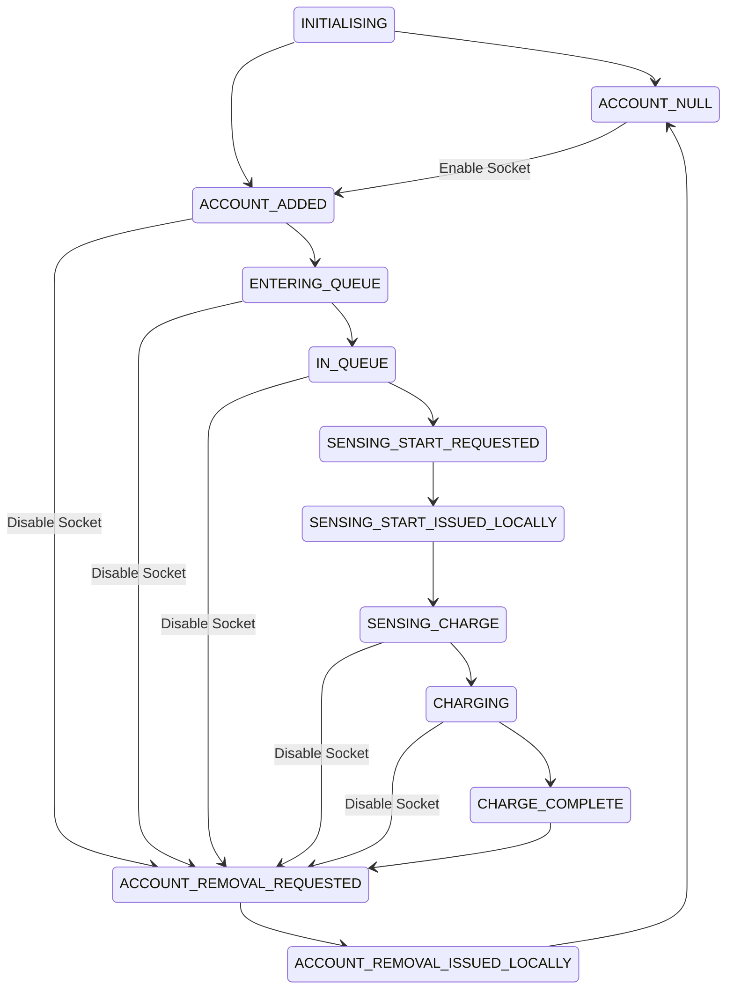

```mermaid
stateDiagram-v2
    INITIALISING --> ACCOUNT_NULL
    INITIALISING --> ACCOUNT_ADDED
    ACCOUNT_NULL --> ACCOUNT_ADDED: Enable Socket
    ACCOUNT_ADDED --> ENTERING_QUEUE
    ACCOUNT_ADDED --> ACCOUNT_REMOVAL_REQUESTED: Disable Socket
    ENTERING_QUEUE --> IN_QUEUE
    ENTERING_QUEUE --> ACCOUNT_REMOVAL_REQUESTED: Disable Socket
    IN_QUEUE --> SENSING_START_REQUESTED
    IN_QUEUE --> ACCOUNT_REMOVAL_REQUESTED: Disable Socket
    SENSING_START_REQUESTED --> SENSING_START_ISSUED_LOCALLY
    SENSING_START_ISSUED_LOCALLY --> SENSING_CHARGE
    SENSING_CHARGE --> CHARGING
    SENSING_CHARGE --> ACCOUNT_REMOVAL_REQUESTED: Disable Socket
    CHARGING --> CHARGE_COMPLETE
    CHARGING --> ACCOUNT_REMOVAL_REQUESTED: Disable Socket
    CHARGE_COMPLETE --> ACCOUNT_REMOVAL_REQUESTED
    ACCOUNT_REMOVAL_REQUESTED --> ACCOUNT_REMOVAL_ISSUED_LOCALLY
    ACCOUNT_REMOVAL_ISSUED_LOCALLY --> ACCOUNT_NULL
```
